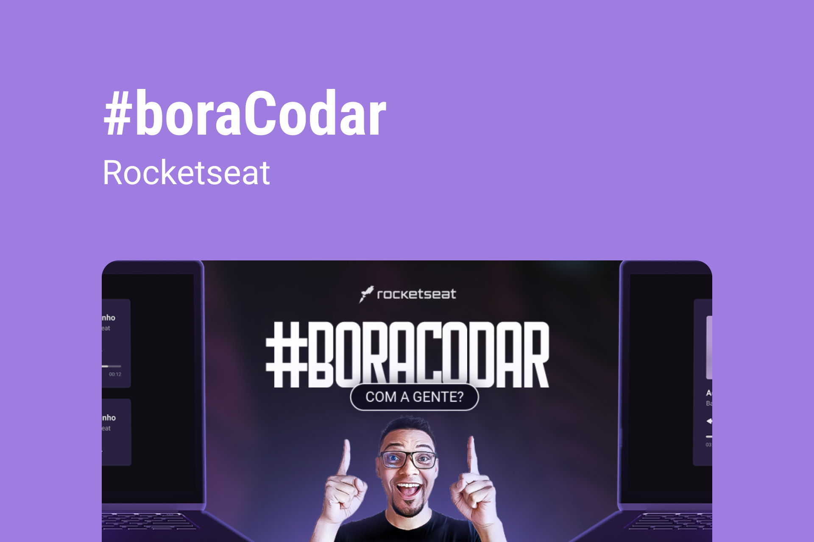

# #boraCodar

<div align="center">
  
</div>

---

## 🚀 Tecnologias
Esse projeto foi desenvolvido com as seguintes tecnologias:
- [Next.js](https://nextjs.org/)
- [React](https://react.dev/)
- [TypeScript](https://www.typescriptlang.org/)
- [Tailwind com PostCSS](https://tailwindcss.com/)
- [ESLint](https://eslint.org/)

---

## ⚙ Ferramentas e Dependências
- [@rocketseat/eslint-config](https://github.com/rocketseat/eslint-config-rocketseat)

---

## 💻 Projeto
O #boracodar é um repositório referente à todos os projetos construídos durante as semanas intensivas do Bora Codar, da Rocketseat

---

## 🎨 Layout e 'projetinhos'

<table>
  <thead>
    <th>ID</th>
    <th>Nome</th>
    <th>Layout</th>
    <th>Código</th>
    <th>URL</th>
  </thead>
  <tbody>
    <tr>
      <td align="center">1</td>
      <td>Music Player</td>
      <td align="center">
        <a target="_blank" href="https://www.figma.com/file/XnielIsj9qrix1qxAQLT9X/23boraCodar-Desafio-1/duplicate">
          🎨
        </a>
      </td>
      <td align="center">
        <a target="_blank" href="#">
          💻
        </a>
      </td>
      <td align="center">
        <a target="_blank" href="#">
          🌐
        </a>
      </td>
    </tr>
  </tbody>
</table>

---

## 📑 Licensa

Esse projeto está sobre a Licensa MIT. Confira o [LISENSE](./LICENSE).

---

## 💻 Acesse o Projeto

### ✅ Requisitos
Antes de tudo, você precisa ter o [Git](https://git-scm.com/) e o [Node.js](https://nodejs.org/en) instalados.

### 🏁 Passo a passo
```bash
# Clone o projeto
git clone https://github.com/Gustavo-Nasc/Bora-Codar

# Acesse a pasta do projeto
cd Bora-Codar/

# Instale as dependências
npm i

# Execute o projeto (Em ambiente de desenvolvimento)
npm run dev

# O servidor será inicializado e poderá ser acessado pela porta 3000 no localhost
# localhost:3000
```

---

## ✍ Autor

[@gustanascsouza](https://www.linkedin.com/in/gustanascsouza/) & [Rocketseat](https://www.rocketseat.com.br/)